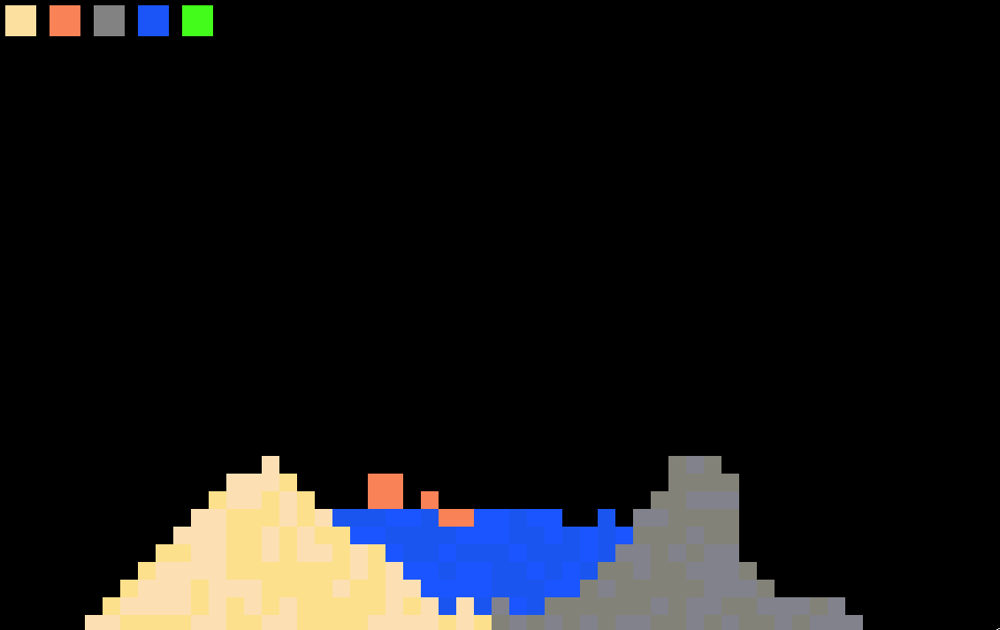

# powderfb
powder simulation inspired by [the powder toy](https://powdertoy.co.uk/).
 

## how does it work
all the particles are stored in a 2d array and their positions are changed every step.
there is a pretty bad ui system that allows for a _little bit_ of extensibility using traits.

## installation
the lastest release can be downloaded from the [releases page](https://github.com/cash-i1/powderfb/releases/).

